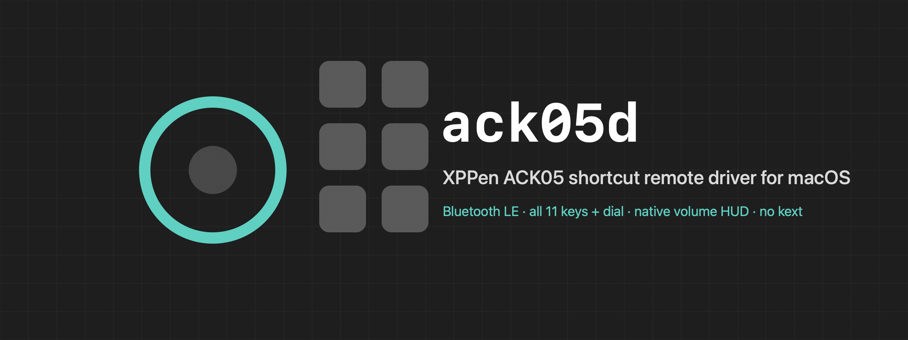
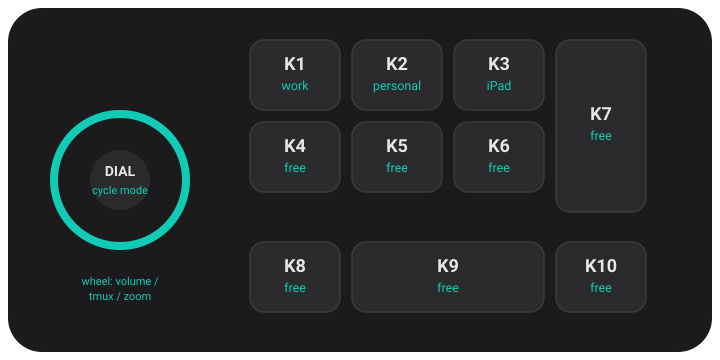

<p align="center">
  
</p>

<p align="center">
  
  
  
  
</p>

A userspace driver for the **[XPPen ACK05 "Shortcut Remote"](https://www.xp-pen.com/product/ack05-wireless-shortcut-remote.html)** on macOS. It talks to the
remote directly over Bluetooth LE, so you can bind every key to a shell command, drive
configurable wheel modes, and use the dial centre button — **without the official XPPen
driver**.

Built because the official XPPen macOS driver (a Qt app) crashes on multi-display setups,
and because no open-source project drove this remote over Bluetooth on the Telink
hardware revision. `ack05d` does.

## Features

- **All 11 buttons + the dial**, including the dial centre button the official driver
  hides and keystroke remappers can't reach.
- **Bind anything** — each key runs a shell command: launch an app, switch a tmux
  session, run a script.
- **Configurable wheel modes** — the dial cycles through modes you define (e.g. volume,
  window switching, zoom); the wheel drives the active one.
- **Native macOS HUD** — volume and brightness show the real system overlay, not a
  homegrown popup.
- **No kext, no root, no crashes** — a small signed launch agent; Bluetooth only.
- **Optional on-screen overlay** showing which action fired.

## Install

```sh
git clone https://github.com/LiveNL/ack05d.git
cd ack05d
./install.sh
```

That builds the driver, installs it as a login agent (auto-starts, auto-restarts), and
builds the optional `hud` overlay into `~/.local/bin`. Then create your config (below)
and press a key.

> The wheel's **native volume/brightness HUD** needs Accessibility. `install.sh` prints
> the one-time step: add the app under **System Settings → Privacy & Security →
> Accessibility**. Everything else works with no permission.

## Configure

Your mapping lives in `~/.config/ack05d/config.json`. Start from
[`config.example.json`](config.example.json). Learn which physical key is which:

```sh
./.build/release/ack05d --identify     # press keys; prints BTN_1..BTN_10 and DIAL
```

<p align="center">
  
</p>

<p align="center"><sub>Button names as <code>ack05d</code> reports them — bind each one in your config.</sub></p>

```json
{
  "overlayCommand": "/Users/you/.local/bin/hud",
  "buttons": {
    "BTN_1": { "type": "shell", "command": "open -a Safari", "label": "Safari" },
    "DIAL":  { "type": "wheelModeCycle" }
  },
  "wheelModes": [
    {
      "name": "volume",
      "cw":  { "type": "mediaKey", "key": "volume_up" },
      "ccw": { "type": "mediaKey", "key": "volume_down" }
    },
    {
      "name": "zoom",
      "cw":  { "type": "keystroke", "keystroke": "cmd+=" },
      "ccw": { "type": "keystroke", "keystroke": "cmd+-" }
    }
  ]
}
```

### Action types

| Type | Does | Fields |
| --- | --- | --- |
| `shell` | Run a shell command | `command`, `label` |
| `mediaKey` | Post a system media key (native HUD) | `key` — `volume_up/down`, `mute`, `brightness_up/down`, `play_pause`, `next`, `previous` |
| `keystroke` | Synthesize a key chord | `keystroke` — e.g. `cmd+=`, `shift+cmd+4` |
| `wheelModeCycle` | Advance to the next wheel mode | — |
| `none` | Explicitly unbound | — |

`overlayCommand` is any program called as `<cmd> <label> <seconds>`; the bundled `hud`
shows a single, fixed-width overlay. Add `"silent": true` to an action whose command
draws its own overlay. Edit the file and the daemon reloads automatically.

`connectedLabel` shows an overlay the moment the remote is ready after (re)connecting —
a boot/wake confirmation. `disconnectedLabel` shows one when the link drops. Set either
to `""` to suppress; the defaults are `"ACK05 ready"` and silent.

<p align="center">
  
</p>

<p align="center"><sub>The optional <code>hud</code> overlay — one panel that refreshes as you press keys.</sub></p>

## Requirements

- macOS 13 or newer, Apple Silicon or Intel
- Bluetooth (grant Bluetooth access on first run)
- Xcode command-line tools (`xcode-select --install`) to build

## Uninstall

```sh
launchctl bootout gui/$(id -u)/io.github.livenl.ack05d
rm -rf ~/Library/LaunchAgents/io.github.livenl.ack05d.plist "~/Applications/ACK05 Remote.app"
```

## How it works

`ack05d` puts the remote into its vendor/bitmask mode over a private GATT service and
decodes the button frames — the same channel the official driver uses. The full
handshake, frame format, hardware-revision notes and credits are in
[`docs/PROTOCOL.md`](docs/PROTOCOL.md).

Bluetooth LE is the only implemented transport; USB cable / 2.4 GHz dongle is documented
there but not yet built.

## Disclaimer

`ack05d` is an independent, unofficial project and is **not affiliated with, authorized
or endorsed by XPPen or Hanvon Ugee**. "XPPen" and "ACK05" are trademarks of their
respective owners, used here only to describe the hardware this driver interoperates
with. It ships **no XPPen code, firmware or assets** — it is a clean-room interoperability
implementation built from public sources and independent observation of the device's
own protocol. See [`NOTICE`](NOTICE).

## License

MIT — see [`LICENSE`](LICENSE).
